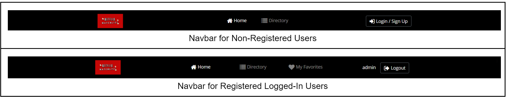
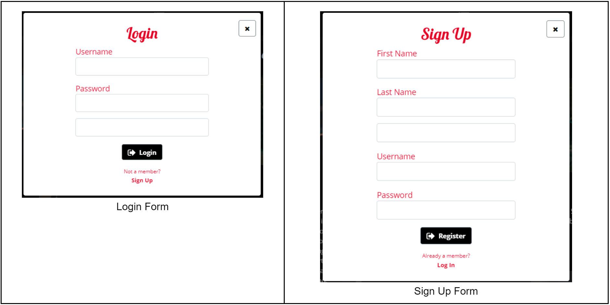
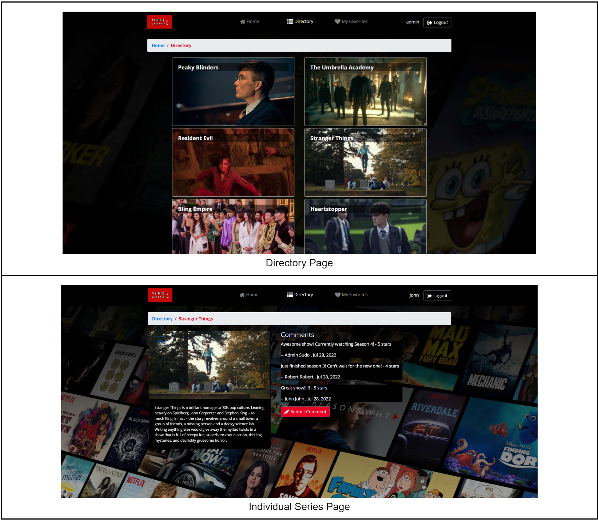
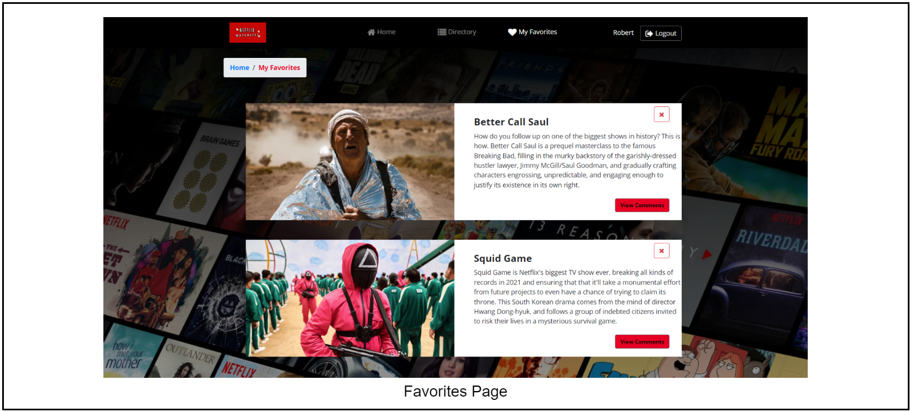

#  Blackpink Fan Page

## Introduction 
My full-stack web application is a watchlist where users can make an account and comment on and favorite the hottest Netflix series. The key features of my full-stack website are:

The key features are:
* A Home page displaying a show from each ‘Trending Now’, ‘New Release’, and ‘Netflix Exclusive’ categories.
* A Directory page featuring a collection of Netflix series.
* A separate routing page for each series, where authenticated can discuss with one another in the comments section.
* A Favorites page containing all of the registered users’ favorite Netflix series.

## Design and Implementation

> __Navbar:__ Sticky-top navbar menu with brand logo and button to activate “Login/Sign Up pop-up modal”. ‘My Favorites’ navigation link is only shown to logged-in users. 
---

>__Login/SignUp Modal:__ Pop-up modal with two different tabs, “Login” and “Sign Up”. 
---

>__Directory Section:__ Showcases a collection of Netflix series with a cover image and title. Clicking on one of the card elements will navigate the user to the corresponding routing page for the specific show. On the individual series page, registered authorized users can comment in the comment section. Non-registered users will receive a 401: Unauthorized alert when trying to post a comment. Authorized users can also favorite a show by clicking the heart icon on the top left corner of the image.
---

>__Favorites Section:__ Authenticated users will have access to save favorite shows in their ‘My favorites’ collection. Users can also delete shows from this collection by clicking the delete icon.
---